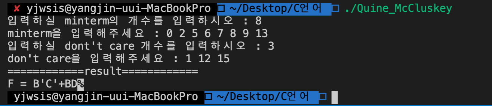
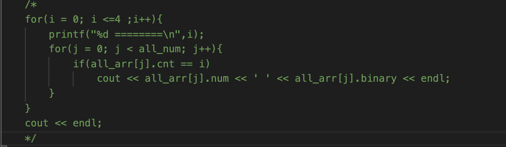

# Quine_McCluskey
Quine McCluskey algorithm made in CPP
- 사용방법  
1. gcc -o Quine_McCluskey Quine_McCluskey.cpp
2. ./Quine_McCluskey로 실행

- 실행화면

- 연산 과정을 보고 싶은 경우  
line 80이랑 line 89에 있는 <주석>을 삭제

